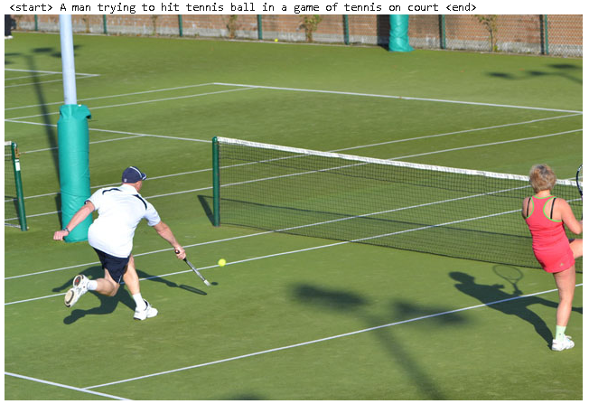
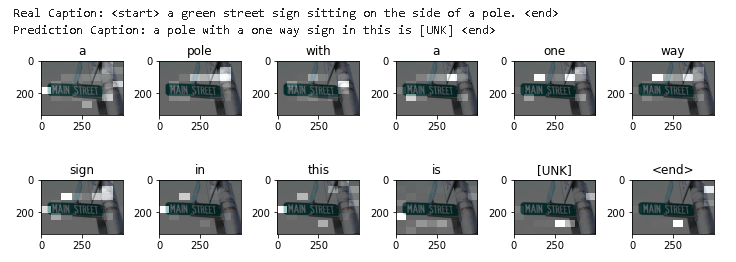
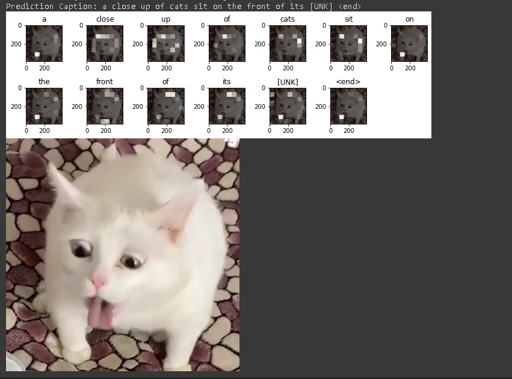
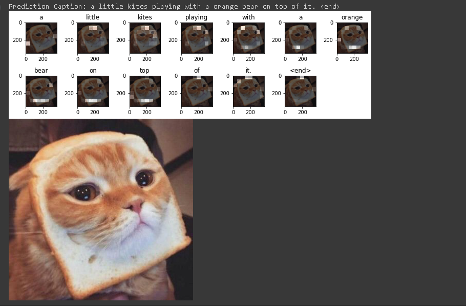
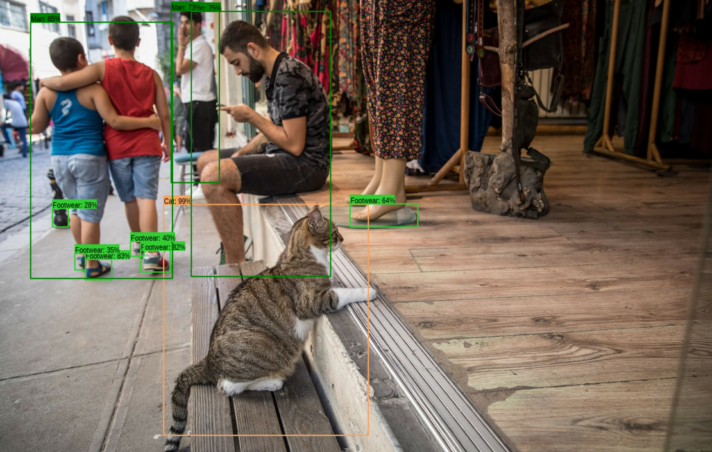

# PRiR zadania lab 11

#### 1. Program do podpisywania obrazków
Przykład obrazu do trenowania programu:
  

Przykład obrazu, który był użyty przy trenowaniu programu oraz został użyty do testu działania programu:
  

Testy własnych obrazków:
  

Ze względu na użycie dość małych ilości danych, tytuły są czasami dziwne, np:
  

#### 2. Program do rozpoznawania obiektów na zdjęciu
 
  

## Źródło
https://www.tensorflow.org/tutorials/text/image_captioning
